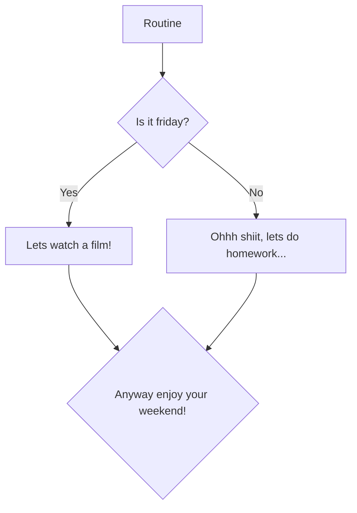

```mermaid
flowchart TD
    A[Routine] --> B{Is it friday?}
    B -- Yes --> C[Lets watch a film!]
    B -- No --> D[Ohhh shiit, lets do homework...]
    C --> E{Anyway enjoy your weekend!}
    D --> E{Anyway enjoy your weekend!}
```